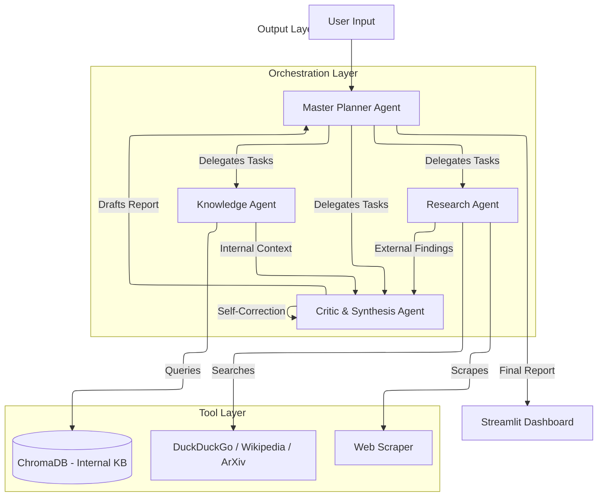

# 🤖 AgentForge: Autonomous Multi-Agent Research Platform


**AgentForge** is a production-grade, autonomous multi-agent research platform designed to run **100% locally** on consumer hardware (e.g., NVIDIA RTX 3060). It leverages a squad of specialized AI agents to orchestrate deep research, synthesize findings from both the live web and internal knowledge bases (RAG), and generate comprehensive, cited reports.

---

## 📺 Project Demo

[](https://www.youtube.com/watch?v=uJYopUFqIsM)

> *Click the thumbnail above to watch the full walkthrough of AgentForge in action.*

---

## 🏗️ Technical Architecture

AgentForge employs a hierarchical multi-agent architecture where a **Master Planner** delegates tasks to specialized execution agents. The system utilizes a **ReAct (Reasoning + Acting)** pattern to ensure transparent decision-making.



### 🧠 The Agent Squad

1.  **🧠 Master Planner Agent**: The strategist. Decomposes complex user queries into actionable subtasks (e.g., "Research X," "Check internal docs for Y," "Compare X and Y").
2.  **🔍 Research Agent**: The explorer. Scours the internet (DuckDuckGo, Wikipedia, ArXiv) for real-time, external information. Handles rate limits and verifies source credibility.
3.  **💾 Knowledge Agent (RAG)**: The archivist. Retrieves proprietary or internal information from the local Vector Database (ChromaDB) to provide context that the public internet doesn't have.
4.  **✍️ Critic Agent**: The editor. Synthesizes all information, checks for factual consistency, ensures every claim is cited, and generates the final professional report.

---

## 🚀 Key Features

*   **⚡ 100% Local Execution**: Runs entirely on your hardware using **Ollama** (powered by `qwen2.5:3b`) for zero inference costs and maximum privacy.
*   **🔗 Hybrid RAG Pipeline**: Seamlessly combines external web search with internal document retrieval for holistic answers.
*   **🛠️ Robust Tooling**:
    *   **Web Search**: DuckDuckGo for general queries.
    *   **Academic Search**: ArXiv for scientific papers.
    *   **Scraping**: Custom scraper to read full page content.
    *   **Vector Search**: Semantic retrieval from local documents.
*   **🧠 Episodic Memory**: Remembers past research missions to avoid redundant work, stored in a local SQLite database.
*   **📊 Transparent Observability**: Real-time "Matrix-style" logs show exactly what each agent is doing (Thought -> Action -> Observation).
*   **🖥️ Production-Ready UI**: Feature-rich **Streamlit** dashboard with:
    *   **Research Tab**: Main interface for running missions.
    *   **History Tab**: View and review past reports.
    *   **Knowledge Base Tab**: Manage ingested documents.
    *   **Live Logs Tab**: Debug agent actions in real-time.

---

## 🛠️ Installation & Setup

### Prerequisites

*   **OS**: Windows (tested), Linux, or macOS.
*   **Python**: 3.10 or higher.
*   **Ollama**: Installed and running.

### 1. Setup Ollama (Local LLM)
AgentForge relies on Ollama. Ensure it is installed from [ollama.com](https://ollama.com).

Open your terminal and pull the required models:
```powershell
# Core LLM for Agents
ollama pull qwen2.5:3b

# Embedding Model for RAG
ollama pull nomic-embed-text
```

### 2. Clone & Install
```bash
git clone https://github.com/your-username/agentforge.git
cd agentforge

# Run the setup script (Windows PowerShell) to create venv and install dependencies
.\setup.ps1
```

---

## 💻 Usage Guide

### 1. Start the Platform
Launch the main user interface:
```powershell
.\venv\Scripts\streamlit run agentforge/ui/streamlit_app.py
```
This will open `http://localhost:8501` in your browser.

### 2. Ingest Knowledge (Optional)
To make the **Knowledge Agent** effective, you need to feed it data.
1.  Place PDF, Markdown (`.md`), or Text (`.txt`) files into `agentforge/data/knowledge_base/`.
2.  Run the ingestion script:
    ```powershell
    .\venv\Scripts\python agentforge/scripts/ingest_documents.py
    ```
    *This creates vector embeddings of your documents so the agent can "read" them.*

### 3. Run a Research Mission
1.  Go to the **"Research & Analysis"** tab.
2.  Enter a detailed query.
    *   *Example 1 (Web Only)*: "What were the key announcements at NVIDIA GTC 2024?"
    *   *Example 2 (Hybrid)*: "Compare the rise of [Internal Company] (from our docs) with OpenAI."
3.  Click **"Start Research Mission"**.
4.  Watch the agents collaborate in the **"Live Logs"** tab or the status expander.

---

## 📂 Project Structure

```
agentforge/
├── agents/             # Agent definitions (Planner, Researcher, etc.)
├── tools/              # Tool implementations (Search, Scraper, RAG)
├── workflows/          # Orchestration logic (CrewAI setup)
├── memory/             # Vector Store (ChromaDB) & SQLite history
├── ui/                 # Streamlit dashboard code
├── api/                # FastAPI backend (optional endpoint)
├── data/               # Knowledge base & Vector DB storage
└── monitoring/         # Logging configuration
```

---

## 🛡️ Privacy & Security
*   **Data Privacy**: All documents and vector embeddings are stored **locally** on your machine. No data is sent to the cloud.
*   **Zero-Cost**: Uses local open-source models; no API keys or credits required.

---

## 🤝 Contributing
Contributions are welcome! Please fork the repository and submit a Pull Request.

---

