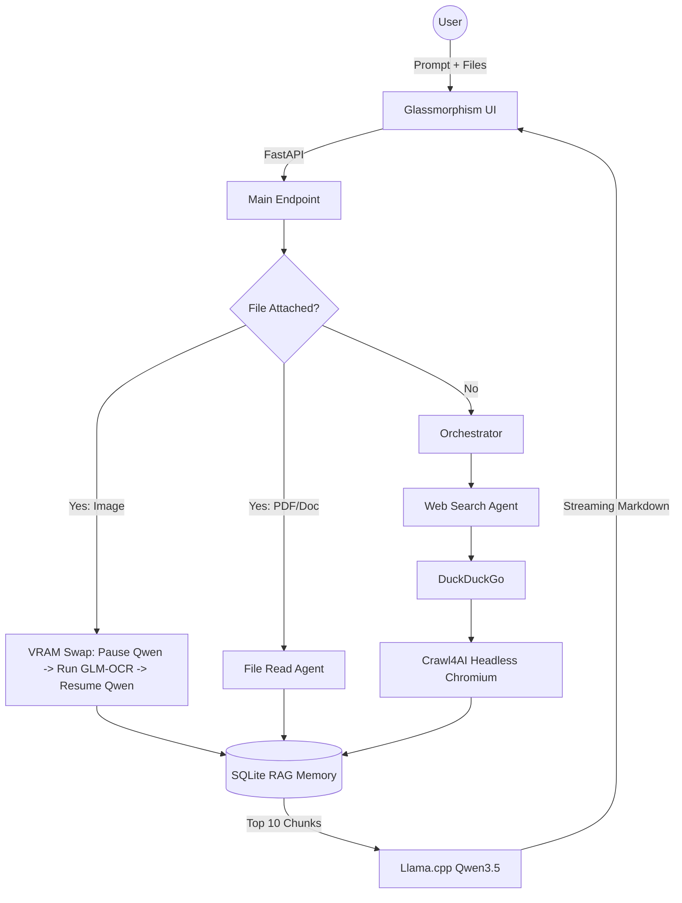
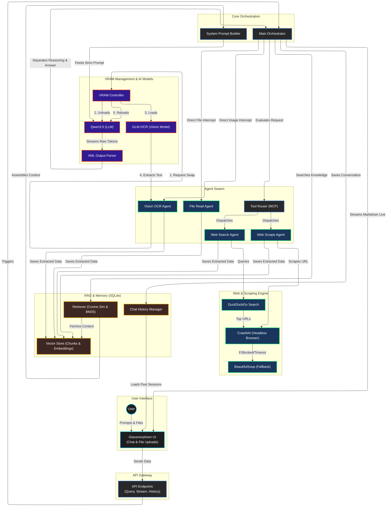

<div align="center">

# 🌌 AgentForge
### The Autonomous, Zero-Bloat, Multi-Agent RAG Platform

[](https://python.org)
[](https://fastapi.tiangolo.com/)
[](https://sqlite.org/)
[](https://github.com/ggerganov/llama.cpp)
[](https://playwright.dev/)

*A completely local, fully offline AI research assistant featuring intelligent VRAM swapping, deep web scraping, and a breathtaking Perplexity-style UI.*

</div>

---

## ⚡ Overview

**AgentForge** is not just another wrapper. It is a highly optimized, completely autonomous multi-agent research platform designed to run on consumer hardware (e.g., RTX 3060 6GB). It orchestrates a swarm of specialized agents that can browse the live internet, scrape JavaScript-heavy websites, parse complex PDF documents, and perform high-fidelity Vision OCR—all while managing its own memory and VRAM dynamically.

No API keys. No cloud dependencies. No bloated vector databases. Just pure, unadulterated local AI power.

---

## ✨ Key Features

### 🧠 Intelligent VRAM Management (Hot-Swapping)
Running a large language model and a massive vision model simultaneously on a 6GB GPU will instantly crash your system. AgentForge solves this elegantly:
- The system runs the fast **Qwen3.5-4B** model as the core brain via `llama.cpp`.
- When you upload an image, AgentForge **suspends Qwen**, flushing 100% of it from VRAM.
- It dynamically loads the official **GLM-OCR** (Safetensors) model directly onto the GPU, processes the image at lightning speed, wipes the GPU memory cleanly via PyTorch garbage collection, and resumes Qwen seamlessly.

### 🕸️ Deep Web Search & Crawl (Hybrid Engine)
AgentForge bypasses standard API rate-limits by employing a robust, anti-bot fallback chain:
1. **Search:** Uses `DuckDuckGo` (`ddgs`) to securely find the top URLs.
2. **Primary Scrape:** Bootstraps **Crawl4AI** using a headless Chromium browser to execute JavaScript, bypass Cloudflare/bot-protections, and extract clean semantic Markdown.
3. **Fallback:** If a website blocks headless browsers, it instantly falls back to a custom `BeautifulSoup` + `markdownify` Python scraper to guarantee context injection.

### 💾 Zero-Bloat SQLite RAG
We stripped out heavy memory hogs like ChromaDB. AgentForge uses a hyper-optimized, pure **SQLite** memory architecture:
- Context chunks and CPU-generated embeddings are serialized directly into an `agentforge.db` file.
- **Session Isolation:** Each chat is strictly isolated. Vector cosine-similarity is computed via NumPy instantly in RAM, ensuring zero memory leak across different sessions.

### 🎨 Perplexity-Style UI
A gorgeous, modern, zero-scrollbars frontend built with Vanilla JS and CSS (No React/Node.js bloat):
- **Glassmorphism Design:** Dark mode, translucent overlays, and an interactive particle physics background canvas.
- **Live "Thinking" Stream:** Watch the AI's internal reasoning stream live into a collapsible UI block (styled with a sleek Lightbulb icon) before it generates the final answer.
- **Source Cards & Context Modals:** View exactly what websites and files the AI read through beautiful, clickable Source Cards and an expandable raw context modal.

---

## ⚙️ Architecture Flow



---

## 🚀 Installation & Setup

### 1. Prerequisites
- **OS:** Windows 10/11
- **Python:** 3.12+
- **GPU:** NVIDIA GPU with CUDA support (Minimum 6GB VRAM recommended)

### 2. Clone the Repository
```bash
git clone https://github.com/yourusername/AgentForge.git
cd AgentForge
```

### 3. Automatic Setup
AgentForge comes with a fully automated setup script that creates your virtual environment, installs all pip dependencies, and downloads the required AI models.

Simply open PowerShell as Administrator and run:
```powershell
.\setup_infrastructure.ps1
```

*Note: The script will download several gigabytes of models (Qwen3.5-4B GGUF and GLM-OCR Safetensors). Please be patient!*

### 4. GPU Acceleration (Crucial)
To ensure the Vision OCR model runs on your GPU and not your CPU, you must install the CUDA-enabled version of PyTorch.
Open your activated virtual environment and run:
```bash
pip install torch torchvision --index-url https://download.pytorch.org/whl/cu121
```

---

## 🕹️ Usage

AgentForge features absolute one-click operation via Windows Batch files.

### Starting the Platform
Simply double-click:
📄 `start_agentforge.bat`

**What it does:**
1. Cleans any ghost processes on port `8081`.
2. Activates the Python virtual environment.
3. Launches the FastAPI backend and natively clones pristine `[filename:line]` terminal logs into `logs/log.log`.
4. Automatically opens `http://localhost:8081` in your default web browser.

### Stopping the Platform
Simply double-click:
📄 `stop_agentforge.bat`

**What it does:**
1. Gracefully shuts down the FastAPI server.
2. Force-kills the `llama.cpp` process, instantly freeing 100% of your VRAM.
3. Closes the terminal windows.

---

## 📂 Project Structure

```text
AgentForge/
├── backend/
│   ├── agents/               # Swarm logic (Search, Scrape, OCR, File Read)
│   ├── llm/                  # Llama.cpp streaming client & SQLite Memory Manager
│   ├── mcp_layer/            # Tool Routing and Execution
│   ├── rag/                  # Embeddings, Retriever, Vector Store
│   ├── config.py             # Global constants
│   ├── logger_setup.py       # Custom stdout/stderr OS-level interceptor
│   └── main.py               # FastAPI Endpoints
├── frontend/
│   ├── static/               # Highlight.js & Marked.js
│   ├── app.js                # SSE streaming, UI logic, Particle Physics
│   ├── index.html            # Main UI Layout
│   └── style.css             # Glassmorphism & Perplexity styling
├── logs/                     # Single unified log.log file
├── models/                   # Local weights (Qwen GGUF, GLM-OCR)
├── uploads/                  # User uploaded documents
├── start_agentforge.bat      # One-click startup
└── stop_agentforge.bat       # One-click graceful teardown
```

---


# AgentForge Comprehensive System Architecture

This diagram provides a high-level, easy-to-understand overview of the AgentForge platform. It focuses on the logical flow, agent interactions, tools, and the hardware management process without getting bogged down in specific filenames.




<div align="center">
  <i>Built with absolute precision. Engineered for autonomy.</i><br>
  <b>Welcome to AgentForge.</b>
</div>