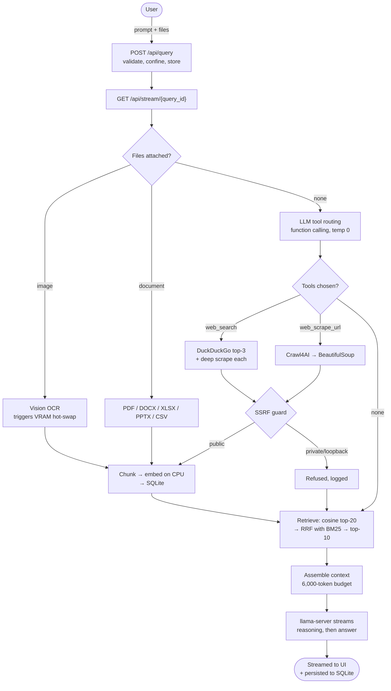

<div align="center">

# 🌌 AgentForge
### A Fully Local Multi-Agent Research Assistant on One 8 GB GPU

[](https://python.org)
[](https://fastapi.tiangolo.com/)
[](https://sqlite.org/)
[](https://github.com/ggerganov/llama.cpp)
[](AgentForge/tests)

*No cloud API. No API keys. Every performance number below is measured on the machine described, and reproducible with the benchmark suite in this repository.*

</div>

---

## ⚡ What it is

AgentForge answers a research question by **deciding for itself which tools to use**, gathering
live evidence with them, and generating a grounded, cited answer — entirely on local hardware.

A local **Qwen3.5-4B** model served by `llama.cpp` performs OpenAI-style function calling to
choose between web search, URL scraping, document reading and vision OCR. Retrieved content is
chunked, embedded on CPU and stored in SQLite; retrieval fuses cosine similarity with BM25.
The answer streams to the browser with the model's reasoning shown separately from its response.

**Why bother when cloud assistants exist?** Because there is a whole category of work — client
material under NDA, unpublished research, internal documents — where pasting the content into a
third-party API is simply not allowed. Local chat UIs keep the data private but are *only* chat:
no live web access, no document ingestion, no OCR, no retrieval. This closes that gap.

---

## 📊 Measured performance

RTX 5060 Laptop (8,151 MiB, `sm_120`) · Windows 11 · PyTorch 2.11.0+cu128 · llama.cpp b8833 · 2026-07-26

| | Result | Sample |
|---|---|---|
| Generation throughput | **79–80 tokens/sec** | 15 runs, 3 prompt sizes |
| Time to first token | **290–335 ms** | 15 runs |
| Research query, end to end | **21.0 s median** | 6 runs, live web retrieval |
| Query with no tools | **10.9 s median** | 8 runs |
| Model hot-swap cycle | **12.25 s** | full evict → load → free → restore |
| Tool-routing accuracy | **97.5%** (39/40), macro-F1 0.971 | 40 labelled prompts |
| Retrieval Recall@3 | **0.95**, MRR 0.896 | 20 labelled queries |
| OCR character error rate | **median 0.000** | 30 rendered samples |
| Fault-injection cases | **10/10 handled** | live against the API |
| Security guard tests | **48/48 passing** | `pytest tests` |

Regenerate all of it yourself with `run_benchmarks.bat`. Raw JSON lands in `rework-proof/evidence/`.

> **Not measured, and not claimed:** answer quality, groundedness, hallucination rate, time
> saved, or ROI. There is no labelled answer set and no timed baseline, so any figure would be
> invented. Earlier versions of this README carried numbers like "<5% hallucination" and
> "~40 tokens/sec" — both were unsupported and have been withdrawn.

---

## ✨ How it works

### 🧠 Two models, 8 GB, and a hot-swap

The constraint that shapes the whole design. Measured on this GPU:

| Component | VRAM |
|---|---:|
| Qwen3.5-4B Q4_K_M, 10k context, fully offloaded | 3,575 MiB |
| GLM-OCR (bfloat16) during inference | 2,329 MiB |
| Desktop, browser, other GPU processes | 1,062 MiB |
| **Both resident at once** | **6,966 MiB of 8,151** |

That leaves 1,185 MiB of headroom — no margin for a longer context or a larger image. So the
system doesn't try. When an image arrives it **terminates the language server**, loads GLM-OCR
onto the GPU, runs inference, frees it, and **restarts the language server**. Teardown and
restart live in a `finally` block, so a crash during inference still restores the system —
verified when a missing dependency crashed the vision load and the language model came back
correctly anyway.

This is a kill and cold-start, not a suspend and resume, and it costs ~12 s per image.

### 🕸️ Deep web search and crawl

DuckDuckGo (`ddgs`, no API key) finds the top 3 URLs, then **Crawl4AI** scrapes each with a
headless Chromium so JavaScript-rendered pages actually yield content. If that fails, a
`httpx` + BeautifulSoup + markdownify fallback takes over.

Measured over 10 public URLs: 10/10 returned content, all via Crawl4AI. The fallback did not
fire on that run — so the primary path is demonstrated, the fallback is not.

### 💾 Zero-bloat SQLite RAG

No ChromaDB, no vector database service. Chunks and CPU-generated embeddings go straight into
`agentforge.db`. Retrieval recalls 20 candidates by cosine similarity, then fuses that ranking
with BM25 using **Reciprocal Rank Fusion**.

That fusion exists because a benchmark caught a real defect: the pipeline used to re-rank by
BM25 *alone*, discarding the cosine score that selected the candidates. Measured on the labelled
set, that dropped Recall@1 from 0.95 to 0.65. Honest caveat — on that same set, cosine alone
still scores highest; fusion is kept because the set contains no exact-identifier queries where
lexical matching wins.

### 🔒 Guards between the model and your machine

The model chooses *which tool to call*. It does not choose *whether it is allowed*.

- `backend/paths.py` — confines every model-supplied file path to `uploads/`
- `backend/net_guard.py` — refuses any URL resolving to a loopback, private, link-local,
  reserved, multicast or unspecified address

Both are covered by the 48 tests, and verified end to end: asking the model to scrape
`http://127.0.0.1:8000/health` or read `C:\Windows\win.ini` is refused, and it answers
gracefully instead of failing.

### 🎨 Perplexity-style UI

Vanilla JS and CSS — 1,142 lines, no framework, no build step, no `node_modules`. Glassmorphism
dark theme, particle background, a **live reasoning stream** on its own SSE channel, source
cards, and an inspector showing the exact retrieved context that went into the prompt.

---

## ⚙️ Architecture



---

## 🚀 Setup

### Prerequisites

- **OS:** Windows 10/11 · **Python:** 3.12 specifically
- **GPU:** NVIDIA with ≥ 6 GB VRAM. Verified on an RTX 5060 Laptop (8 GB, `sm_120`)
- **Disk:** ~12 GB — 5 GB of weights, ~6 GB for the venv, plus Chromium
- `models/Qwen3.5-4B-Q4_K_M.gguf` and `models/GLM-OCR/` present
- A CUDA build of `llama-server.exe` at `AgentForge/llama.cpp/build/bin/Release/`

### Install

```bat
cd AgentForge
setup_agentforge.bat
```

This verifies Python 3.12, the NVIDIA driver and both model files; creates `venv\`; installs
PyTorch and then the rest; installs Chromium for Crawl4AI; and finishes with a **real GPU matrix
multiply** so a broken CUDA install fails at setup instead of at first query.

> ### ⚠️ The CUDA version matters
> PyTorch must come from the **cu128** index:
> ```
> pip install torch torchvision --index-url https://download.pytorch.org/whl/cu128
> ```
> The **cu121** build contains no `sm_120` kernels. On an RTX 50-series GPU it will import
> cleanly, report `cuda.is_available() == True`, and then fail at the first kernel launch.
> `setup_agentforge.bat` handles this for you.

### Run

```bat
cd AgentForge\backend
..\venv\Scripts\activate.bat
python main.py
```

Then open **http://127.0.0.1:8081**. The backend starts and supervises `llama-server` itself.

To stop and free VRAM:

```bat
cd AgentForge
stop_agentforge.bat
```

Both the API and the inference server bind **loopback only**. There is no authentication —
this is a single-user local tool and that is the stated threat model.

### Verify

```bat
cd AgentForge
venv\Scripts\python.exe -m pytest tests -v    :: 48 security tests
run_benchmarks.bat                            :: regenerates every number above
```

---

## 📂 Project structure

```text
AgentForge/
├── backend/
│   ├── agents/               # web_search, web_scrape_url, read_local_file, ocr_image
│   ├── llm/                  # llama-server lifecycle, streaming client, SQLite memory
│   ├── mcp_layer/            # tool schemas, LLM router, concurrent dispatch
│   ├── rag/                  # embedder, vector store, RRF retriever, context builder
│   ├── paths.py              # filesystem confinement for untrusted paths
│   ├── net_guard.py          # SSRF guard for outbound URLs
│   ├── metrics.py            # per-stage JSONL timing, correlated by query_id
│   ├── config.py             # constants (no secrets — none exist)
│   ├── logger_setup.py       # stdout tee with [file:line] prefixes
│   └── main.py               # FastAPI endpoints + SSE
├── frontend/                 # index.html, app.js, style.css + vendored libs
├── benchmarks/               # 10 harnesses, 2 labelled datasets, figure generator
├── tests/                    # 48 tests over the security guards
├── models/                   # local weights (not in git)
└── uploads/                  # user documents (not in git)
```

---

## 🧱 Known limitations

Stated plainly rather than left to be discovered.

- **Single user.** The inference server has one decode slot. Measured: median latency goes from
  9.7 s at one concurrent request to 208 s at eight, and throughput *falls* 74%. Concurrency
  doesn't just fail to help — it makes things worse.
- **Not deployed.** Needs a CUDA GPU, supervises a process by image name, and holds pending-query
  state in a process-local dict. Any one blocks a multi-user deployment.
- **Retrieval scales linearly.** No index; every chunk in the session is loaded and JSON-parsed
  per query. 31 ms at 20 chunks, 246 ms at 2,000.
- **No authentication.** Any local process can read or delete any session.
- **No CI.** The 48 tests exist; nothing runs them automatically.
- **No answer-quality evaluation.** The largest gap, and the reason no accuracy number appears
  anywhere in this README.
- **Benchmarks are author-written and small** — 40 routing prompts, 20 retrieval queries,
  30 OCR samples, one machine, one day.
- **OCR figures are an upper bound.** Tested on cleanly rendered text, not photographs or scans.
- The `mcp_layer` directory does **not** implement Model Context Protocol — it is an in-process
  registry using OpenAI function-calling schemas. The name is inherited and misleading.

---

<div align="center">
  <b>Built by <a href="https://linkedin.com/in/smitmakodia">Smit Makodia</a></b><br>
  <i>AI Engineer — generative AI, agentic AI, and automation-based AI workflows and pipelines</i>
</div>
